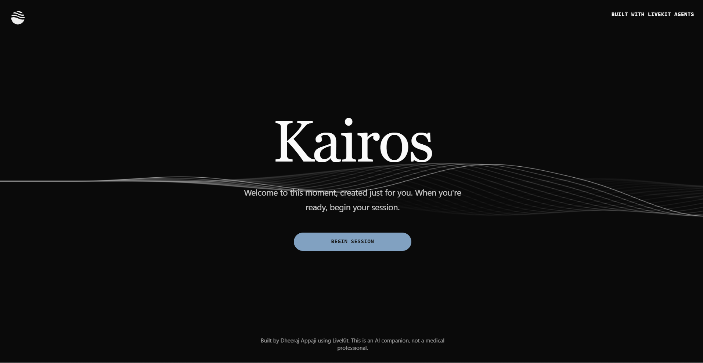
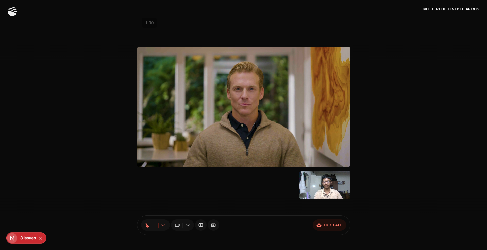
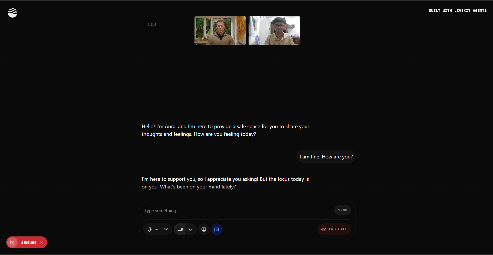

# Kairos — A Space to Be Heard

Kairos is an AI-powered companion designed for mindful conversation and self-reflection. It provides an empathetic, non-judgmental space for users to express their feelings, leveraging a sophisticated backend agent and a sleek, modern frontend.

The platform integrates real-time voice communication, text-to-speech, and a virtual avatar to create an immersive and supportive experience.

<p align="center">
  
</p>

<p align="center">
  
  
  
  
  
</p>

---

## 🎯 Key Features

-   **Empathetic AI Therapist:** The agent, "Aura," is designed to be a great listener, providing supportive and concise responses to encourage open sharing.
-   **Real-Time Voice Interaction:** Built on the LiveKit Agents framework for low-latency, real-time audio conversations.
-   **Virtual Avatar:** A digital persona powered by Tavus that lip-syncs to the agent's voice, creating a more personal and engaging interaction.
-   **Advanced AI Stack:** Utilizes best-in-class services for Speech-to-Text (Deepgram), Language Model (OpenAI GPT-4o mini), and Text-to-Speech (ElevenLabs).
-   **Modern Frontend:** A responsive and customizable user interface built with Next.js, React, and Tailwind CSS.
-   **User Controls:** Full control over microphone, camera, and screen sharing during sessions.
-   **Theming:** Includes both light and dark modes with a clean, calming aesthetic.

---

## 🧑‍💻 Tech Stack

| Component         | Technology/Service                                                                                             |
| ----------------- | -------------------------------------------------------------------------------------------------------------- |
| **Framework**     | Next.js (React)                                                                                                |
| **AI Agent SDK**  | LiveKit Agents                                                                                                 |
| **Language Model**| OpenAI (gpt-4o-mini)                                                                                           |
| **Speech-to-Text**| Deepgram (nova-2)                                                                                              |
| **Text-to-Speech**| ElevenLabs                                                                                                     |
| **Virtual Avatar**| Tavus                                                                                                          |
| **Styling**       | Tailwind CSS, shadcn/ui                                                                                        |
| **Real-Time**     | LiveKit                                                                                                        |
| **Deployment**    | Optimized for Vercel                                                                                           |

---

## 📸 Screenshots
<p align="center"> </p> <table> <tr> <td align="center"><strong>Video Session</strong></td> <td align="center"><strong>Chat Interface</strong></td> </tr> <tr> <td width="50%"></td> <td width="50%"></td> </tr> </table>

---

## 🚀 Getting Started

The project is divided into two main parts: `frontend` and `backend`.

### Backend Setup (The AI Agent)

1.  **Navigate to the backend directory:**
    ```bash
    cd backend
    ```

2.  **Create and activate a virtual environment:**
    ```bash
    python -m venv venv
    source venv/bin/activate  # On Windows: venv\Scripts\activate
    ```

3.  **Install dependencies:**
    ```bash
    pip install -r requirements.txt
    ```

4.  **Configure Environment Variables:**
    Create a `.env` file in the `backend/` directory and add your API keys:
    ```env
    # .env
    ELEVENLABS_VOICE_ID=...
    ELEVENLABS_API_KEY=...
    TAVUS_API_KEY=...
    TAVUS_REPLICA_ID=...
    TAVUS_PERSONA_ID=...
    # OpenAI and Deepgram keys are typically set in your system environment
    ```

5.  **Run the Agent Worker:**
    ```bash
    python aura_voice.py
    ```

### Frontend Setup (The Web App)

1.  **Navigate to the frontend directory:**
    ```bash
    cd frontend
    ```

2.  **Install dependencies (using pnpm):**
    ```bash
    pnpm install
    ```

3.  **Configure Environment Variables:**
    Copy `.env.example` to `.env.local` and add your LiveKit credentials:
    ```env
    
    # .env.local
    # LiveKit Credentials
      LIVEKIT_URL=wss://your-livekit-url
      LIVEKIT_API_KEY=your-livekit-api-key
      LIVEKIT_API_SECRET=your-livekit-api-secret
      
      # Service API Keys
      DEEPGRAM_API_KEY=your-deepgram-api-key
      OPENAI_API_KEY=your-openai-api-key
      ELEVENLABS_API_KEY=your-elevenlabs-api-key
      
      # ElevenLabs Voice Configuration
      ELEVENLABS_VOICE_ID=your-elevenlabs-voice-id
      
      # Tavus Virtual Avatar Configuration
      TAVUS_API_KEY=your-tavus-api-key
      TAVUS_REPLICA_ID=your-replica-id
      TAVUS_PERSONA_ID=your-persona-id
    
    ```

4.  **Start the development server:**
    ```bash
    pnpm dev
    ```
    Open [http://localhost:3000](http://localhost:3000) in your browser to begin a session.

---

## 📁 Project Structure

```
kairos/
├── backend/
│   ├── aura_voice.py       # Main AI agent logic and session handler
│   ├── requirements.txt    # Python dependencies for the agent
│   └── .env                # Backend API keys (gitignored)
│
└── frontend/
    ├── app/                # Next.js App Router (pages, layouts, API routes)
    ├── components/         # React components (UI, LiveKit controls)
    ├── hooks/              # Custom React hooks
    ├── lib/                # Utility functions and type definitions
    ├── public/             # Static assets (images, fonts)
    ├── app-config.ts       # App branding and feature configuration
    ├── package.json        # Frontend dependencies and scripts
    └── .env.local          # Frontend environment variables (gitignored)
```

---

## 🤝 Contributing

Contributions are welcome! If you have ideas for improvements or want to fix a bug, please feel free to open an issue or submit a pull request.

---

## 👨‍💻 Author

Made with 💙 by Dheeraj Appaji.
